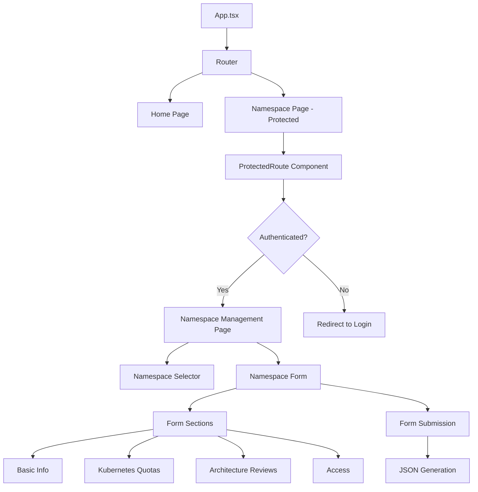

# Design Document

## Overview

The Namespace Management feature adds a protected route at `/namespace` that allows authenticated users to view and edit Kubernetes namespace configurations. The feature integrates with the existing OIDC authentication system and follows the established patterns in the application for routing, theming, and component structure.

The implementation uses a form-based interface with a namespace selector dropdown, comprehensive form fields for namespace configuration, and JSON generation capabilities for API integration.

## Architecture

### High-Level Architecture



### Component Hierarchy

```
App
├── Router
│   ├── Home (existing)
│   └── ProtectedRoute
│       └── NamespacePage
│           ├── NamespaceSelector
│           └── NamespaceForm
│               ├── BasicInfoSection
│               ├── KubernetesQuotasSection
│               ├── ArchitectureReviewsSection
│               └── AccessEndpointsSection
```

### Data Flow

#### Viewing/Editing Existing Namespace
1. User navigates to `/namespace`
2. ProtectedRoute checks authentication status
3. If authenticated, NamespacePage fetches namespace names list from API endpoint
4. Dropdown displays available namespace names
5. User selects namespace from dropdown
6. NamespacePage fetches full configuration data for selected namespace from API endpoint
7. Form populates with fetched namespace data
8. User edits form fields
9. On submit, form validates and generates JSON output
10. Generated JSON is displayed/logged for API integration

#### Creating New Namespace
1. User navigates to `/namespace`
2. ProtectedRoute checks authentication status
3. If authenticated, NamespacePage fetches namespace names list from API endpoint
4. User clicks "Create New Namespace" button
5. Form populates with default values for a new namespace
6. System generates a unique ID for the new namespace
7. User fills in form fields
8. On submit, form validates and generates JSON output with new namespace data
9. Generated JSON is displayed/logged for API integration

## Components and Interfaces

### 1. ProtectedRoute Component

**Purpose**: Wrapper component that enforces authentication for protected routes

**Props**:
```typescript
interface ProtectedRouteProps {
  children: React.ReactNode;
}
```

**Behavior**:
- Uses `useAuth()` hook to check authentication status
- If not authenticated, triggers OIDC login flow
- If authenticated, renders children
- Shows loading state during authentication check

### 2. NamespacePage Component

**Purpose**: Main page component that orchestrates namespace management

**State**:
```typescript
interface NamespacePageState {
  namespaceNames: Array<{ id: string; name: string }>; // List of namespace names for dropdown
  selectedNamespaceId: string | null;
  selectedNamespaceData: NamespaceConfig | null; // Full config data for selected namespace
  isCreatingNew: boolean;
  isLoadingList: boolean; // Loading state for namespace names list
  isLoadingDetails: boolean; // Loading state for individual namespace data
  error: string | null;
}
```

**Behavior**:
- Fetches namespace names list from API endpoint on mount
- Manages namespace selection
- Fetches full namespace configuration data when a namespace is selected
- Manages create new namespace mode
- Generates unique IDs for new namespaces
- Passes selected namespace data or default values to form
- Handles form submission and JSON generation
- Switches between "select existing" and "create new" modes
- Handles separate loading states for list and details
- Handles errors for both API calls independently

### 3. NamespaceSelector Component

**Purpose**: Dropdown for selecting which namespace to view/edit, with option to create new

**Props**:
```typescript
interface NamespaceSelectorProps {
  namespaceNames: Array<{ id: string; name: string }>; // Only names, not full configs
  selectedNamespace: string | null;
  onSelect: (namespaceId: string) => void;
  onCreateNew: () => void;
  isCreatingNew: boolean;
  disabled?: boolean;
}
```

**Behavior**:
- Renders dropdown with namespace names from the names list
- Provides "Create New Namespace" button
- Triggers callback on selection change
- Triggers callback when user clicks create new
- Shows visual indication when in create mode
- Supports disabled state during loading

### 4. NamespaceForm Component

**Purpose**: Main form component for editing namespace configuration

**Props**:
```typescript
interface NamespaceFormProps {
  namespace: NamespaceConfig | null;
  isCreatingNew: boolean;
  onSubmit: (data: NamespaceConfig) => void;
}
```

**State**:
```typescript
interface NamespaceFormState {
  formData: NamespaceConfig;
  validationErrors: Record<string, string>;
  isDirty: boolean;
}
```

**Behavior**:
- Manages form state with controlled inputs
- Initializes with default values when creating new namespace
- Validates fields on blur and submit
- Conditionally shows explanation fields for architecture reviews
- Prevents submission with validation errors
- Emits form data on successful submission
- Shows appropriate messaging for create vs edit mode

### 5. Form Section Components

**BasicInfoSection**: Application Name, Namespace Name, Namespace Description

**KubernetesQuotasSection**: All quota fields (services, pods, CPU, memory, storage, PVCs)

**ArchitectureReviewsSection**: SolutionArch, TechArch, SecurityArch reviews with conditional explanations

**AccessEndpointsSection**: AD Group, AWS IAM Role, Egress Endpoints

Each section follows consistent styling and validation patterns.

## API Endpoints

### GET /api/namespaces

**Purpose**: Fetch list of namespace names for dropdown population

**Response**:
```typescript
{
  namespaces: Array<{
    id: string;
    name: string;
  }>
}
```

**Example Response**:
```json
{
  "namespaces": [
    { "id": "ns-001", "name": "my-app-prod" },
    { "id": "ns-002", "name": "my-app-staging" },
    { "id": "ns-003", "name": "analytics-prod" }
  ]
}
```

**Mock Implementation**: For initial development, this endpoint will return mock data from a static JSON file or hardcoded response.

### GET /api/namespaces/:id

**Purpose**: Fetch full configuration data for a specific namespace

**Parameters**:
- `id`: The unique identifier of the namespace

**Response**: Full `NamespaceConfig` object (see Data Models section below)

**Example Response**:
```json
{
  "id": "ns-001",
  "applicationName": "My Application",
  "namespaceName": "my-app-prod",
  "namespaceDescription": "Production environment for My Application",
  "kubernetesQuotas": {
    "services": 10,
    "pods": 50,
    "requestsCpu": "4",
    "requestsMemory": "8Gi",
    "limitsMemory": "16Gi",
    "requestsEphemeralStorage": "10Gi",
    "persistentVolumeClaims": 5
  },
  "namespaceAccessAdGroup": "app-team-prod",
  "solutionArchReview": {
    "approved": true
  },
  "techArchReview": {
    "approved": false,
    "explanation": "Needs optimization for resource usage"
  },
  "securityArchReview": {
    "approved": true
  },
  "awsIamRole": "arn:aws:iam::123456789012:role/my-app-role",
  "egressEndpointsList": ["api.example.com", "db.example.com"]
}
```

**Mock Implementation**: For initial development, this endpoint will return mock data based on the namespace ID.

## Data Models

### NamespaceConfig Interface

```typescript
interface KubernetesQuotas {
  services: number;
  pods: number;
  requestsCpu: string;
  requestsMemory: string;
  limitsMemory: string;
  requestsEphemeralStorage: string;
  persistentVolumeClaims: number;
}

interface ArchitectureReview {
  approved: boolean;
  explanation?: string;
}

interface NamespaceConfig {
  id: string; // Unique identifier for selection
  applicationName: string;
  namespaceName: string;
  namespaceDescription: string;
  kubernetesQuotas: KubernetesQuotas;
  namespaceAccessAdGroup: string;
  solutionArchReview: ArchitectureReview;
  techArchReview: ArchitectureReview;
  securityArchReview: ArchitectureReview;
  awsIamRole: string;
  egressEndpointsList: string; // Comma-separated or newline-separated list
}
```

### Sample JSON Structure

```json
{
  "namespaces": [
    {
      "id": "ns-001",
      "applicationName": "My Application",
      "namespaceName": "my-app-prod",
      "namespaceDescription": "Production environment for My Application",
      "kubernetesQuotas": {
        "services": 10,
        "pods": 50,
        "requestsCpu": "4",
        "requestsMemory": "8Gi",
        "limitsMemory": "16Gi",
        "requestsEphemeralStorage": "10Gi",
        "persistentVolumeClaims": 5
      },
      "namespaceAccessAdGroup": "app-team-prod",
      "solutionArchReview": {
        "approved": true
      },
      "techArchReview": {
        "approved": false,
        "explanation": "Needs optimization for resource usage"
      },
      "securityArchReview": {
        "approved": true
      },
      "awsIamRole": "arn:aws:iam::123456789012:role/my-app-role",
      "egressEndpointsList": "api.example.com, db.example.com"
    }
  ]
}
```

### Default Values for New Namespaces

When creating a new namespace, the following default values are used:

```typescript
const defaultNamespaceConfig: Omit<NamespaceConfig, 'id'> = {
  applicationName: '',
  namespaceName: '',
  namespaceDescription: '',
  kubernetesQuotas: {
    services: 5,
    pods: 20,
    requestsCpu: '2',
    requestsMemory: '4Gi',
    limitsMemory: '8Gi',
    requestsEphemeralStorage: '5Gi',
    persistentVolumeClaims: 2
  },
  namespaceAccessAdGroup: '',
  solutionArchReview: {
    approved: false,
    explanation: ''
  },
  techArchReview: {
    approved: false,
    explanation: ''
  },
  securityArchReview: {
    approved: false,
    explanation: ''
  },
  awsIamRole: '',
  egressEndpointsList: []
};
```

**ID Generation**: New namespace IDs are generated using the format `ns-{timestamp}` to ensure uniqueness.

## Error Handling

### Validation Errors

- **Required Fields**: Application Name, Namespace Name, Namespace Description, AD Group, AWS IAM Role
- **Numeric Fields**: Services count, Pods count, PVC count must be valid positive integers
- **Resource Strings**: CPU, memory, storage fields should follow Kubernetes resource format (e.g., "4", "8Gi")
- **Conditional Required**: Explanation required when any architecture review is "No"

### Error Display

- Inline validation errors below each field
- Error summary at top of form on submit attempt
- Red border on invalid fields
- Error messages in red text with appropriate contrast for dark mode

### Data Loading Errors

- Display error message if JSON fails to load
- Provide retry mechanism
- Graceful degradation with empty state message

## Testing Strategy

### Component Testing

1. **ProtectedRoute Component**
   - Verify redirect when not authenticated
   - Verify children render when authenticated
   - Test loading state display

2. **NamespaceSelector Component**
   - Test dropdown renders all namespaces
   - Verify selection callback fires correctly
   - Test disabled state
   - Test "Create New Namespace" button functionality
   - Verify visual indication when in create mode

3. **NamespaceForm Component**
   - Test form population with namespace data
   - Test form population with default values for new namespace
   - Verify all fields are editable
   - Test validation for required fields
   - Test validation for numeric fields
   - Test conditional explanation fields for architecture reviews
   - Verify form submission with valid data
   - Verify submission blocked with invalid data
   - Test unique ID generation for new namespaces

4. **Form Section Components**
   - Test each section renders correctly
   - Verify field updates trigger state changes
   - Test styling consistency across themes

### Integration Testing

1. **End-to-End Flow - Edit Existing**
   - Navigate to /namespace while unauthenticated
   - Complete authentication
   - Select namespace from dropdown
   - Edit form fields
   - Submit form
   - Verify JSON generation

2. **End-to-End Flow - Create New**
   - Navigate to /namespace while authenticated
   - Click "Create New Namespace" button
   - Verify form shows default values
   - Fill in required fields
   - Submit form
   - Verify JSON generation with unique ID

3. **Data Persistence**
   - Verify form state persists during editing
   - Test form reset on namespace change
   - Test switching between create mode and select mode

### Validation Testing

1. Test all required field validations
2. Test numeric field validations
3. Test conditional explanation requirement
4. Test form submission prevention with errors
5. Test error message display

## Routing Integration

### Route Configuration

Add to `App.tsx`:

```typescript
<Routes>
  <Route path="/" element={<Home />} />
  <Route 
    path="/namespace" 
    element={
      <ProtectedRoute>
        <NamespacePage />
      </ProtectedRoute>
    } 
  />
</Routes>
```

### Navigation

- Add link to Navbar component for easy access
- Ensure proper active state styling for /namespace route

## Styling and Theming

### Design Principles

- Follow existing Tailwind CSS patterns
- Support both light and dark themes
- Use consistent spacing and typography
- Ensure proper contrast ratios for accessibility
- Responsive design for mobile and desktop

### Form Styling

- Input fields: Consistent padding, border, and focus states
- Labels: Clear, positioned above inputs
- Sections: Visual separation with borders or background colors
- Buttons: Primary action (Submit) and secondary actions (Reset/Cancel)
- Error states: Red borders and text with sufficient contrast

### Theme Support

All components must support:
- Light mode: White backgrounds, dark text
- Dark mode: Dark gray backgrounds, light text
- Proper color transitions when theme changes
- Accessible contrast ratios in both modes

## Future Enhancements

1. **API Integration**: Replace JSON file loading with actual API calls
2. **Real-time Validation**: Validate fields against backend constraints
3. **Audit Trail**: Track changes to namespace configurations
4. **Bulk Operations**: Edit multiple namespaces at once
5. **Export/Import**: Download and upload namespace configurations
6. **Search and Filter**: Find namespaces quickly in large lists
7. **Permissions**: Role-based access control for editing capabilities
